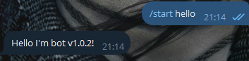

# About this project

My Bot is the result of an assignment in a DevOps course. This bot greets the user and report his version if a command in the Telegram is used:

```
/start hello
```


You can try it youself - https://t.me/staspetrenko_bot

Frameworks are used for this bot `github.com/spf13/cobra` and `gopkg.in/telebot.v3`

# Getting started
### Requirements
- [Go](https://go.dev/doc/install)

### Install
Clone the repository:

```
git clone git@github.com:StasSweepy/testbot1.git
```

Install all are needed frameworks and libraries:
```
cd testbot1 && go get
```

# How to get TELE_TOKEN?
Use [BotFather](https://t.me/BotFather) for create your `TELE_TOKEN`.

Enter your token in silent mode:

```
read -s TELE_TOKEN
```

Paste your TELE_TOKEN

```
export TELE_TOKEN
```

# How to Run?
This command wiil start this bot

```
./bot start
```
